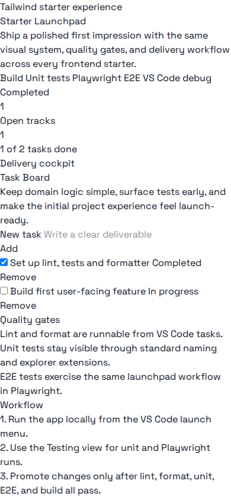

# angular-template — Quick Tutorial (5 minutes)

## Prerequisites

- Node.js + pnpm and `make`

## What you'll build

Start the Angular dev server and capture a mobile screenshot of the
app's root page. This shows the template's initial UI and layout.

## Steps

1. Install

```bash
cd Templates/angular-template
make install
```

2. Run dev server (default port: `4200`)

```bash
make start
```

3. Capture mobile screenshot

```bash
bash Scripts/ubuntu/screenshots-generic.sh \
  --config Templates/angular-template/docs/screenshot-config.json
```

4. Open image at:

`Templates/angular-template/docs/screenshots/v1/mobile-home.png`

Preview placeholder:


